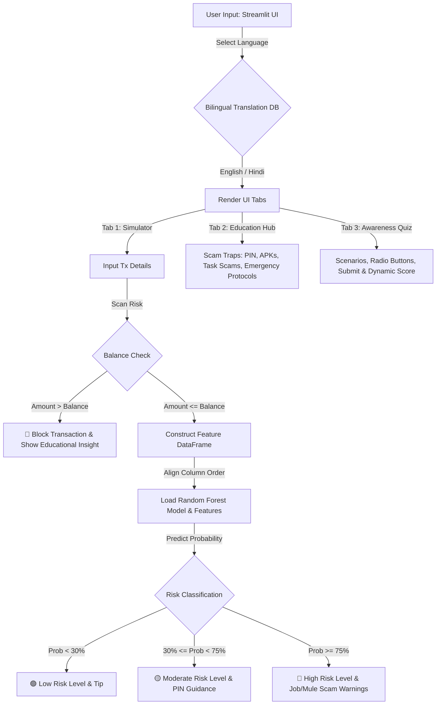

# 🛡️ UPIShield: UPI Fraud Awareness & Transaction Risk Simulator

UPIShield is an interactive educational web platform designed to raise awareness about digital banking scams and evaluate transaction risks in real-time. Built using **Streamlit** and powered by a **Machine Learning** classifier, this application simulates UPI/mobile transaction scenarios, calculates fraud risk levels, and explains the underlying data parameters. 

This project was developed as part of a **Social Internship Program** and is mapped directly to **UN Sustainable Development Goal 4 (SDG 4: Quality Education)** by promoting financial literacy and secure digital payment habits.

---

## 🗺️ System Architecture

The following diagram illustrates how the UPIShield application processes user input, evaluates transaction risk with the Random Forest model, and delivers bilingual educational insights.



---

## 🌟 Key Features

1. **📱 Real-Time Risk Simulator**
   - Users can customize transaction parameters such as transaction type (`TRANSFER` or `CASH_OUT`), transaction amount, current balance, recipient's estimated balance, and hour of simulation.
   - The Random Forest model evaluates these values on the fly to yield a fraud probability.
   - Classifies risk into **Low (🟢)**, **Moderate (🟡)**, and **High (🔴)** levels with interactive prevention alerts tailored to each level.

2. **🔬 Explainable AI**
   - Explains the model's logic under the hood. It alerts the user when typical fraud characteristics are present—such as emptying a sender's entire account balance (`newbalanceOrig` = 0) and sending to an empty recipient account (`oldbalanceDest` = 0).

3. **📚 Cyber Education Hub**
   - Detailed walkthroughs of modern social-engineering traps:
     - **The "PIN to Receive" Trap:** Educating users that PIN entry is exclusively for sending money.
     - **APK/Screen-Sharing Scams:** Explaining how downloading remote desktop apps leads to OTP intercepts.
     - **Part-Time Task Scams:** Spotting deposit scams early on WhatsApp and Telegram.
     - **Emergency Protocol:** Checklist for blocking accounts, reporting to the Indian National Cyber Crime Helpline (**1930**), and registering complaints on [cybercrime.gov.in](https://cybercrime.gov.in).

4. **🧠 Interactive Awareness Quiz**
   - Scenario-based quiz questions testing user responses to phishing and UPI debit-link scams.
   - Saves scores dynamically across questions and triggers visual feedback (e.g., balloons for a perfect score).

5. **🌐 Fully Bilingual Interface**
   - Uses a localized dictionary mapping to change all labels, buttons, alerts, and instructions instantly between **English** and **Hindi (हिंदी)**.

---

## 🤖 Machine Learning Model Details

The transaction risk assessor is powered by a **Random Forest Classifier** trained on synthetic financial transaction data representing standard mobile transaction behaviors (using the popular **PaySim** dataset).

### Model Configurations:
- **Algorithm:** Random Forest Classifier (Scikit-Learn)
- **Hyperparameters:**
  - `n_estimators=50`
  - `max_depth=10`
  - `class_weight='balanced'`
  - `random_state=42`
- **Trained Rows:** Over 2,770,409 transaction records (filtered exclusively for `TRANSFER` and `CASH_OUT` events since fraudulent behavior does not appear in other transaction types).
- **Evaluation Metrics:**
  - **Accuracy:** ~98%
  - **Recall (Fraud Class):** 96%
  - **F1-Score (Fraud Class):** 0.25 (balanced to ensure highly sensitive alerts for suspicious activity).

### Input Features (7 Dimensions):
1. `step`: Hour of simulation (representing the time of day).
2. `amount`: Amount transferred in the transaction.
3. `oldbalanceOrg`: Sender's starting balance before transaction.
4. `newbalanceOrig`: Sender's ending balance after transaction.
5. `oldbalanceDest`: Recipient's starting balance before transaction.
6. `newbalanceDest`: Recipient's ending balance after transaction.
7. `type_TRANSFER`: One-hot encoded transaction type (1 for TRANSFER, 0 for CASH_OUT).

---

## 📁 Repository Structure

```
📂 Fraud-Detection-AI-Model
├── 📄 app.py                  # Main Streamlit web application & UI
├── 📓 Fraud Detection.ipynb   # Jupyter Notebook containing data prep, model training & exports
├── 📦 upi_fraud_model.pkl     # Trained Random Forest classifier binary (joblib model)
├── 📦 model_features.pkl      # List of feature column names matching model training order
├── 📄 requirements.txt        # Python package dependencies
├── 📄 notes.txt               # Developer guidelines & translation layout
├── 📄 .gitignore              # Ignores __pycache__, notebooks checkpoints, and large datasets
└── 📄 README.md               # Project documentation (this file)
```

> [!NOTE]
> The source training dataset `paysim.csv` (~493 MB) is excluded from this repository using `.gitignore` to adhere to Git hosting size limits.

---

## 🛠️ Installation & Setup

To run this application locally, follow these steps:

### Prerequisites
- Python 3.8 or higher installed on your local machine.

### Setup Instructions
1. **Clone the Repository:**
   ```bash
   git clone https://github.com/Sid2403-max/Fraud-Detection-AI-Model.git
   cd "Social Internship"
   ```

2. **Install Dependencies:**
   Install required Python packages listed in `requirements.txt`:
   ```bash
   pip install -r requirements.txt
   ```

3. **Verify Model Assets:**
   Ensure the following pre-trained files are located in the project's root folder:
   - `upi_fraud_model.pkl`
   - `model_features.pkl`

4. **Launch the Streamlit App:**
   ```bash
   streamlit run app.py
   ```
   *The application will launch automatically in your default web browser (usually at `http://localhost:8501`).*

---

## 📢 Emergency Action Protocol

If you or someone you know has been a victim of digital financial fraud:
1. **Freeze Accounts:** Contact your bank instantly to freeze transactions and report the fraudster's UPI handles inside your payment application (GPay, PhonePe, Paytm, BHIM, etc.).
2. **Cyber Crime Helpline:** Call **1930** immediately (National Cyber Crime Helpline, India).
3. **Register Complaint:** Submit an official cyber incident report at [cybercrime.gov.in](https://www.cybercrime.gov.in).
